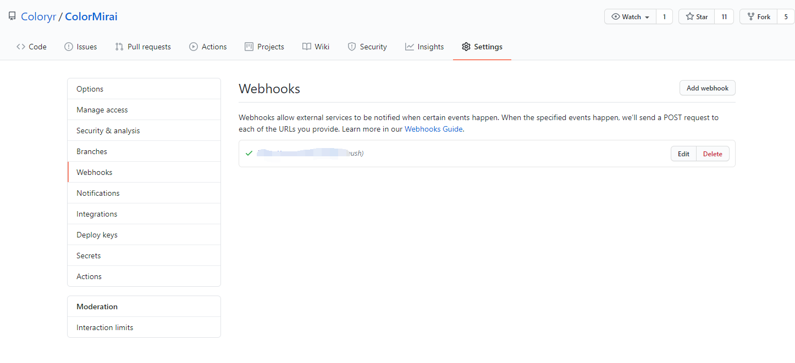

# 酷Q的GitHub推送插件
需要.net5环境  
支持多个群同时发送  
支持单个项目向群发送  

> 安装使用
> 1. 编译并启动ColorMirai，机器人端口必须23333
> 2. 启动GitHubPush
> 3. 调整配置文件
> 4. 准备一个http服务器
> 5. 在github项目的webhook加上http服务器的网址
> 
> 
>
> 配置文件：
> ```Json
> {
>  "推送群号": [
>     571239090,
>     749539856
>   ],
>   "服务器地址": "127.0.0.1",
>   "服务器端口": 25555,
>   "特殊推送": {
>     "builder": [
>       785639073
>     ]
>   }
> }
> ```